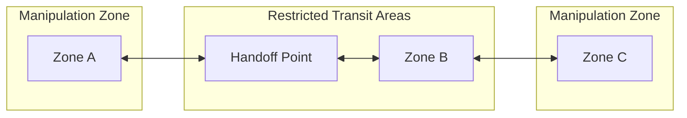
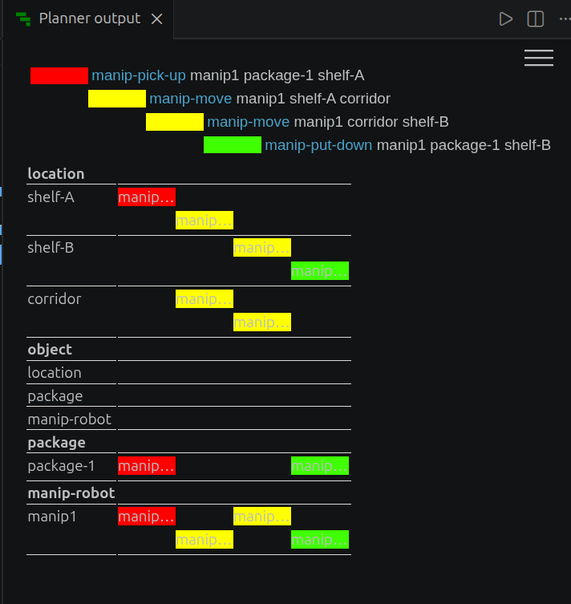
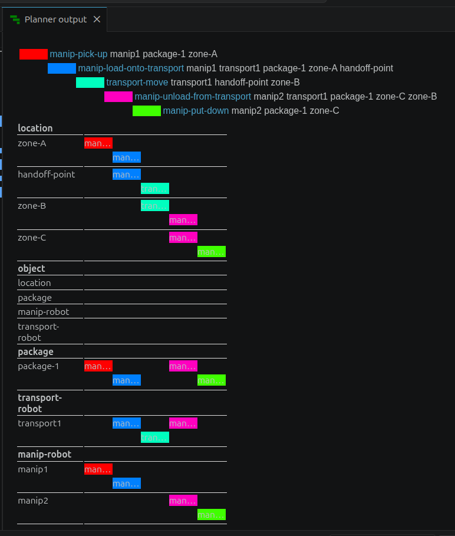
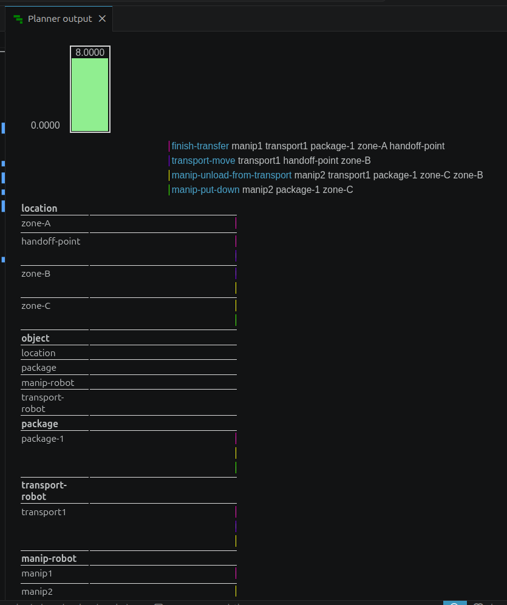

# Warehouse Robotics: Heterogeneous Multi-Agent Planning

## Project Overview
- **What this project is about:** An AI planning project utilizing classical PDDL and advanced PDDL+ to coordinate a team of heterogeneous robots (specialized manipulators and transport robots) in a warehouse environment.
- **Main Idea & Objective:** To mathematically model complex logistical coordination across a spatial topology. The project focuses on solving spatial mutual exclusions, navigating restricted zones, and managing hybrid discrete-continuous temporal logic for handing off packages between specialized agents.

## Problem Overview (D3-V3 Assignment)
This project addresses the **D3-V3: Warehouse Robotics – Heterogeneous Robots** assignment. The warehouse employs two distinct types of robots:
- **Transport Robots:** Fast movers, but possess no manipulation capabilities (cannot pick or place).
- **Manipulator Robots:** Slower movers, but possess full manipulation capabilities.

Because of this **capability specialization**, packages must be transferred between robots to complete delivery tasks. The core requirement is to explicitly represent these heterogeneous capabilities, avoid giving all robots the same actions, and ensure that cooperation is strictly required to solve the logistic tasks. 

## State of the Art
To bridge the gap between symbolic planning and real-world physical constraints, we modeled the solution across two paradigms:

1. **Basic PDDL Model:** 
   We explicitly separated actions into `manip-pick-up`, `transport-move`, and combined transfer actions (`manip-load-onto-transport`). We provided two problems:
   - *Problem 1:* Solvable by a single manipulator robot (no transport required).
   - *Problem 2:* Strict cooperation required, forcing a package hand-off between a manipulator and a transport robot across restricted zones.

2. **Hybrid Dynamical Systems via PDDL+:**
   Classical planning abstracts physical interactions as instantaneous. To push the state-of-the-art, we used PDDL+ to model the physical reality of a robot hand-off:
   - **Continuous Processes:** Introduced `(:process transfer-process)` to model the continuous time it takes to transfer a package between robots.
   - **Autonomous Events:** Introduced `(:event transfer-timeout)` representing a transfer failure (package drops to the floor) if the robots exceed a safe timing threshold.
   - **Timing & Coordination:** Proved how exact timing mathematically dictates coordination feasibility, forcing the planner to schedule the hand-off precisely within an [80, 99] progress window.

## Visual Illustration & Workflow
Below is the structural diagram illustrating the restricted zones and required handoff nodes:



**Project Workflow:** 
Manipulator robots are restricted to Zones A and C to pick up packages. Because they cannot enter transit areas, and because two robots cannot occupy the same location (mutual exclusion), they must coordinate with Transport robots. The manipulators hand off packages across connected edges to Transport robots waiting in the Restricted Transit Areas (Handoff Point and Zone B) to bridge the distance. 

## PDDL Model Explanation
- **Domain & Problem Design:** The domain separates capabilities into two robot types. `manip-robot` handles picking and placing, while `transport-robot` navigates long distances. We added an `(occupied ?l)` predicate to strictly enforce mutual exclusion, preventing physical collisions and sharing of locations. 
- **Modeling Logic:** Because robots cannot share a location, package transfers (`load` and `unload`) are designed to operate across connected edges (`?l1` and `?l2`). In the PDDL+ model, this transfer is not instantaneous; it requires a continuous `(:process transfer-process)` and strict temporal scheduling (`finish-transfer`) to safely complete the transfer before incurring a physical penalty `(:event transfer-timeout)`.

## Choosing a Planner: PDDL vs. PDDL+
The choice of planner is critical and depends on the complexity of the domain being executed:
1. **BFWS --F**: Use this planner while implementing simple, classical PDDL problems (like `domain_q1.pddl`). It excels at discrete state-space search but **cannot** handle time or PDDL+ continuous constructs.
2. **OPTIC / Temporal Fast Downward**: Switch to these planners when you include durative-actions and continuous time. However, OPTIC rejects conditional continuous processes.
3. **ENHSP**: Switch to ENHSP when using **PDDL+** (like `domain_q2.pddl`) to support continuous numeric processes and events. *(Important: Be careful as ENHSP does not seamlessly handle standard `:time` durative boundaries if the problem relies heavily on pure durative-actions, but it natively manages continuous differential equations).*

## How to Run the Project
1. **Prerequisites:** Ensure you have Java 17+ installed. Clone and compile the ENHSP-20 repository, or download the BFWS binary.
2. **VS Code Setup:** Open this project in VS Code with the official PDDL extension. Update your `.vscode/settings.json` to configure your planners (ensuring the `path` and `syntax` point correctly to the ENHSP `.jar` file).
3. **Running PDDL (Q1):** Open `problem2_transport_and_manipulation.pddl`, select the **BFWS** planner (or ENHSP in non-temporal mode), and execute it against `domain_q1.pddl`.
4. **Running PDDL+ (Q2):** Open `problem_q2_combined.pddl`, select the **ENHSP** planner, and execute it against `domain_q2.pddl`.

## Results & Outputs
Below are the actual planner outputs proving the correct logical and temporal execution of all three problems.

### 1. Single Manipulator (Problem 1)
When running `problem1_manipulation.pddl`, the planner executes a simple single-agent transport within the manipulation zones without transport assistance:
```text
0.0: (manip-pick-up manip1 package-1 shelf-A)
1.0: (manip-move manip1 shelf-A corridor)
2.0: (manip-move manip1 corridor shelf-B)
3.0: (manip-put-down manip1 package-1 shelf-B)
```


### 2. Multi-Agent Cooperation (Problem 2)
When running `problem2_transport_and_manipulation.pddl`, the planner correctly coordinates a multi-agent edge-transfer plan across the restricted transit areas:
```text
0.0: (manip-pick-up manip1 package-1 zone-A)
1.0: (manip-load-onto-transport manip1 transport1 package-1 zone-A handoff-point)
2.0: (transport-move transport1 handoff-point zone-B)
3.0: (manip-unload-from-transport manip2 transport1 package-1 zone-C zone-B)
4.0: (manip-put-down manip2 package-1 zone-C)
```


### 3. PDDL+ Hybrid Temporal Transfer (Problem Q2)
When running `problem_q2_combined.pddl`, the planner mathematically calculates a safe 8.0-second delay `[8.0]` to satisfy the continuous transfer process, effectively coordinating the handoff before the failure event (`transfer-timeout`) can trigger:
```text
0: (manip-pick-up manip1 package-1 zone-A)
0: (start-transfer manip1 transport1 package-1 zone-A handoff-point)
0: -----waiting---- [8.0]
8.0: (finish-transfer manip1 transport1 package-1 zone-A handoff-point)
8.0: (transport-move transport1 handoff-point zone-B)
8.0: (manip-unload-from-transport manip2 transport1 package-1 zone-C zone-B)
8.0: (manip-put-down manip2 package-1 zone-C)
```


This final output mathematically proves the successful delivery of the package from Zone A to Zone C by navigating around spatial exclusions, respecting transit areas, and utilizing specialized robot capabilities in tandem across a hybrid continuous timeline.

## Observation
The submitted codes and report have been thoroughly reviewed by the teaching assistant, Omar Kashmar.